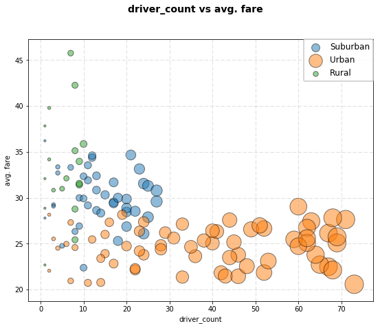
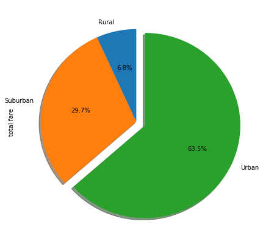
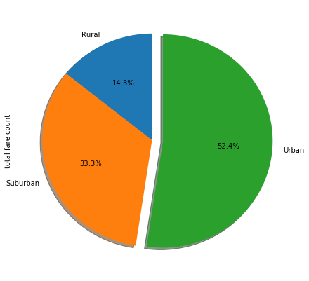
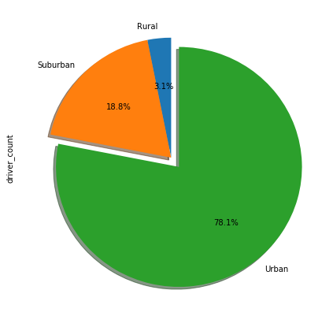

```python
#! users/jjahn/dev/repos/matplot_challenges

import pandas as pd
from pandas import DataFrame, read_csv
import numpy as np
import matplotlib.pyplot as plt
import pylab
import scipy
import random
import os
```


```python
file1 = os.path.join('generated_data','city_data.csv')
file2 = os.path.join('generated_data','ride_data.csv')

cfile = pd.read_csv(file1)
rfile = pd.read_csv(file2)
```


```python
cfile.head()
```


<div>
<table border="1" class="dataframe">
  <thead>
    <tr style="text-align: right;">
      <th></th>
      <th>city</th>
      <th>driver_count</th>
      <th>type</th>
    </tr>
  </thead>
  <tbody>
    <tr>
      <th>0</th>
      <td>Tammyburgh</td>
      <td>11</td>
      <td>Urban</td>
    </tr>
    <tr>
      <th>1</th>
      <td>Melissaborough</td>
      <td>15</td>
      <td>Urban</td>
    </tr>
    <tr>
      <th>2</th>
      <td>Port Brianborough</td>
      <td>62</td>
      <td>Urban</td>
    </tr>
    <tr>
      <th>3</th>
      <td>New Katherine</td>
      <td>68</td>
      <td>Urban</td>
    </tr>
    <tr>
      <th>4</th>
      <td>Lake Charlesside</td>
      <td>65</td>
      <td>Urban</td>
    </tr>
  </tbody>
</table>
</div>


```python
rfile.head()
```


<div>
<table border="1" class="dataframe">
  <thead>
    <tr style="text-align: right;">
      <th></th>
      <th>city</th>
      <th>date</th>
      <th>fare</th>
      <th>ride_id</th>
    </tr>
  </thead>
  <tbody>
    <tr>
      <th>0</th>
      <td>Karenfurt</td>
      <td>2017-01-01 19:03:03</td>
      <td>32.90</td>
      <td>3383346995405</td>
    </tr>
    <tr>
      <th>1</th>
      <td>Melissaborough</td>
      <td>2017-01-01 08:55:58</td>
      <td>19.59</td>
      <td>2791839504576</td>
    </tr>
    <tr>
      <th>2</th>
      <td>Port Sandraport</td>
      <td>2017-01-01 16:21:54</td>
      <td>31.04</td>
      <td>3341437383289</td>
    </tr>
    <tr>
      <th>3</th>
      <td>Curtismouth</td>
      <td>2017-01-03 06:36:53</td>
      <td>15.12</td>
      <td>6557246300691</td>
    </tr>
    <tr>
      <th>4</th>
      <td>Port Michael</td>
      <td>2017-01-03 09:56:52</td>
      <td>19.65</td>
      <td>9887635746234</td>
    </tr>
  </tbody>
</table>
</div>


```python
# Average Fare ($) Per City
# Total Number of Rides Per City
# Total Number of Drivers Per City
# City Type (Urban, Suburban, Rural)

f_df = pd.DataFrame(rfile['fare'].groupby(rfile['city']).sum()).rename(columns={'fare':'total fare'})
f_df['fare count'] = pd.DataFrame(rfile['fare'].groupby(rfile['city']).count())
f_df['avg. fare'] = f_df['total fare'] / f_df['fare count']
f_df = f_df.reset_index()
f_df.head()
```


<div>
<table border="1" class="dataframe">
  <thead>
    <tr style="text-align: right;">
      <th></th>
      <th>city</th>
      <th>total fare</th>
      <th>fare count</th>
      <th>avg. fare</th>
    </tr>
  </thead>
  <tbody>
    <tr>
      <th>0</th>
      <td>Adamschester</td>
      <td>266.35</td>
      <td>9</td>
      <td>29.594444</td>
    </tr>
    <tr>
      <th>1</th>
      <td>Alexisfort</td>
      <td>903.11</td>
      <td>33</td>
      <td>27.366970</td>
    </tr>
    <tr>
      <th>2</th>
      <td>Amberberg</td>
      <td>457.99</td>
      <td>16</td>
      <td>28.624375</td>
    </tr>
    <tr>
      <th>3</th>
      <td>Anthonyfurt</td>
      <td>501.35</td>
      <td>17</td>
      <td>29.491176</td>
    </tr>
    <tr>
      <th>4</th>
      <td>Boyleberg</td>
      <td>161.98</td>
      <td>5</td>
      <td>32.396000</td>
    </tr>
  </tbody>
</table>
</div>


```python
df = pd.merge(f_df, cfile, on='city', how='outer')
df.head()
```


<div>
<table border="1" class="dataframe">
  <thead>
    <tr style="text-align: right;">
      <th></th>
      <th>city</th>
      <th>total fare</th>
      <th>fare count</th>
      <th>avg. fare</th>
      <th>driver_count</th>
      <th>type</th>
    </tr>
  </thead>
  <tbody>
    <tr>
      <th>0</th>
      <td>Adamschester</td>
      <td>266.35</td>
      <td>9</td>
      <td>29.594444</td>
      <td>27</td>
      <td>Suburban</td>
    </tr>
    <tr>
      <th>1</th>
      <td>Alexisfort</td>
      <td>903.11</td>
      <td>33</td>
      <td>27.366970</td>
      <td>24</td>
      <td>Urban</td>
    </tr>
    <tr>
      <th>2</th>
      <td>Amberberg</td>
      <td>457.99</td>
      <td>16</td>
      <td>28.624375</td>
      <td>13</td>
      <td>Suburban</td>
    </tr>
    <tr>
      <th>3</th>
      <td>Anthonyfurt</td>
      <td>501.35</td>
      <td>17</td>
      <td>29.491176</td>
      <td>17</td>
      <td>Suburban</td>
    </tr>
    <tr>
      <th>4</th>
      <td>Boyleberg</td>
      <td>161.98</td>
      <td>5</td>
      <td>32.396000</td>
      <td>13</td>
      <td>Suburban</td>
    </tr>
  </tbody>
</table>
</div>


```python
table = df[['city','avg. fare', 'driver_count', 'type']]
table.head()
```


<div>
<table border="1" class="dataframe">
  <thead>
    <tr style="text-align: right;">
      <th></th>
      <th>city</th>
      <th>avg. fare</th>
      <th>driver_count</th>
      <th>type</th>
    </tr>
  </thead>
  <tbody>
    <tr>
      <th>0</th>
      <td>Adamschester</td>
      <td>29.594444</td>
      <td>27</td>
      <td>Suburban</td>
    </tr>
    <tr>
      <th>1</th>
      <td>Alexisfort</td>
      <td>27.366970</td>
      <td>24</td>
      <td>Urban</td>
    </tr>
    <tr>
      <th>2</th>
      <td>Amberberg</td>
      <td>28.624375</td>
      <td>13</td>
      <td>Suburban</td>
    </tr>
    <tr>
      <th>3</th>
      <td>Anthonyfurt</td>
      <td>29.491176</td>
      <td>17</td>
      <td>Suburban</td>
    </tr>
    <tr>
      <th>4</th>
      <td>Boyleberg</td>
      <td>32.396000</td>
      <td>13</td>
      <td>Suburban</td>
    </tr>
  </tbody>
</table>
</div>


```python

def multi_bubbles (xdf, x, y, g):
    ls = xdf[g].unique()
    plt.figure(figsize=(9,7))
    for i in ls:
        xg_df = xdf.loc[xdf[g] == i]
        plt.scatter( xg_df[x], xg_df[y], marker='o', facecolors=None, edgecolors='black', s=(xg_df[x]*10), alpha=0.50)

    plt.grid(linestyle='--', alpha=0.5)
    plt.xlabel(x)
    plt.ylabel(y)
    plt.suptitle(x +' vs '+y, fontsize=14, fontweight = 'bold')
    leg = plt.legend(ls, ncol=1, fontsize=12, borderaxespad=0, loc=1)
    leg.get_frame().set_linewidth(2.0)
    leg.get_frame().set_facecolor('white')
    
```


```python
# relation between driver count vs average fare categorized by regional types
multi_bubbles (table, 'driver_count', 'avg. fare', 'type')
```





```python
def pie_it (dataframe, x, y, f):
    if f == 'sum':
        tdf = pd.DataFrame(dataframe[y].groupby(dataframe[x]).sum())
    elif f == 'count':
        tdf = pd.DataFrame(dataframe[y].groupby(dataframe[x]).count()).rename(columns={y:y+' '+f})
        y = y+' '+f
    else:
        return 0
    tdf = tdf.reset_index()
    e = (0,0,0.1)
    pie = tdf[y].plot(kind='pie', labels=tdf[x], autopct='%1.1f%%', startangle=90, colors=None, shadow=True, explode=e, figsize=(7,7))
    pie.setxlabel = tdf[x]
    pie.setylabel = tdf[y]

```


```python
# % of Total Fares by City Type(function)
pie_it(df, 'type', 'total fare', 'sum')
```





```python
# % of Total Rides by City Type
pie_it(df, 'type', 'total fare', 'count')
```





```python
# % of Total Drivers by City Type
pie_it(df, 'type', 'driver_count', 'sum')
```





# a consistent trend where drive count increase had a negative correlation to average fare per ride.  Also drive count increased with higher population densities (rural vs suburban vs urban)
