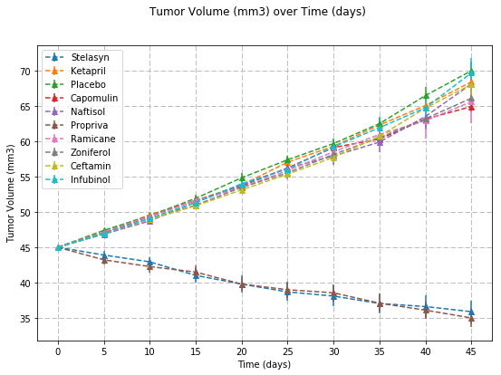
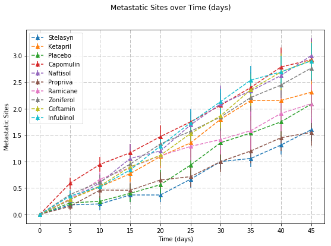
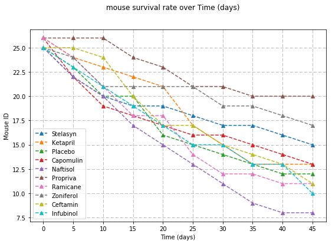
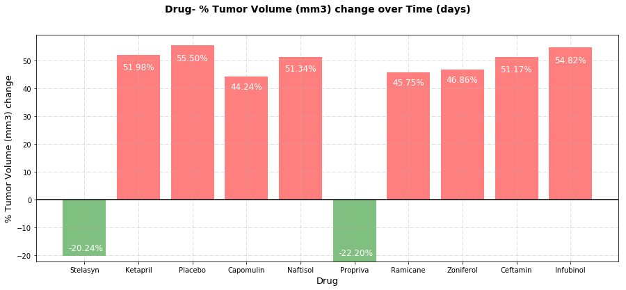

```python
import pandas as pd
import matplotlib.pyplot as plt
from scipy.stats import sem
import numpy as np
import os

cpath = os.path.join('generated_data','clinicaltrial_data.csv')
mpath = os.path.join('generated_data','mouse_drug_data.csv')
```


```python
clinical_data = pd.read_csv(cpath)
mouse_data = pd.read_csv(mpath)
```


```python
clinical_data.head()
```


<div>
<table border="1" class="dataframe">
  <thead>
    <tr style="text-align: right;">
      <th></th>
      <th>Mouse ID</th>
      <th>Timepoint</th>
      <th>Tumor Volume (mm3)</th>
      <th>Metastatic Sites</th>
    </tr>
  </thead>
  <tbody>
    <tr>
      <th>0</th>
      <td>x903</td>
      <td>0</td>
      <td>45.0</td>
      <td>0</td>
    </tr>
    <tr>
      <th>1</th>
      <td>h124</td>
      <td>0</td>
      <td>45.0</td>
      <td>0</td>
    </tr>
    <tr>
      <th>2</th>
      <td>p849</td>
      <td>0</td>
      <td>45.0</td>
      <td>0</td>
    </tr>
    <tr>
      <th>3</th>
      <td>l726</td>
      <td>0</td>
      <td>45.0</td>
      <td>0</td>
    </tr>
    <tr>
      <th>4</th>
      <td>a960</td>
      <td>0</td>
      <td>45.0</td>
      <td>0</td>
    </tr>
  </tbody>
</table>
</div>


```python
mouse_data.head()
```


<div>
<table border="1" class="dataframe">
  <thead>
    <tr style="text-align: right;">
      <th></th>
      <th>Mouse ID</th>
      <th>Drug</th>
    </tr>
  </thead>
  <tbody>
    <tr>
      <th>0</th>
      <td>x903</td>
      <td>Stelasyn</td>
    </tr>
    <tr>
      <th>1</th>
      <td>u281</td>
      <td>Stelasyn</td>
    </tr>
    <tr>
      <th>2</th>
      <td>w929</td>
      <td>Stelasyn</td>
    </tr>
    <tr>
      <th>3</th>
      <td>a189</td>
      <td>Stelasyn</td>
    </tr>
    <tr>
      <th>4</th>
      <td>y587</td>
      <td>Stelasyn</td>
    </tr>
  </tbody>
</table>
</div>


```python
df = pd.merge(clinical_data, mouse_data, on='Mouse ID', how='outer')
df = df.rename(columns={'Timepoint':'Time (days)'})
df.head()
```


<div>
<table border="1" class="dataframe">
  <thead>
    <tr style="text-align: right;">
      <th></th>
      <th>Mouse ID</th>
      <th>Time (days)</th>
      <th>Tumor Volume (mm3)</th>
      <th>Metastatic Sites</th>
      <th>Drug</th>
    </tr>
  </thead>
  <tbody>
    <tr>
      <th>0</th>
      <td>x903</td>
      <td>0</td>
      <td>45.000000</td>
      <td>0</td>
      <td>Stelasyn</td>
    </tr>
    <tr>
      <th>1</th>
      <td>x903</td>
      <td>5</td>
      <td>45.722240</td>
      <td>0</td>
      <td>Stelasyn</td>
    </tr>
    <tr>
      <th>2</th>
      <td>x903</td>
      <td>10</td>
      <td>39.303044</td>
      <td>0</td>
      <td>Stelasyn</td>
    </tr>
    <tr>
      <th>3</th>
      <td>x903</td>
      <td>15</td>
      <td>38.279726</td>
      <td>0</td>
      <td>Stelasyn</td>
    </tr>
    <tr>
      <th>4</th>
      <td>x903</td>
      <td>20</td>
      <td>38.764771</td>
      <td>0</td>
      <td>Stelasyn</td>
    </tr>
  </tbody>
</table>
</div>


```python
drug_list = df['Drug'].unique()
drug_list
```


    array(['Stelasyn', 'Ketapril', 'Placebo', 'Capomulin', 'Naftisol',
           'Propriva', 'Ramicane', 'Zoniferol', 'Ceftamin', 'Infubinol'], dtype=object)


```python
def SD_plot (xdf, c, x, y):
    ls = xdf[c].unique()
    
    plt.figure(figsize=(9,6))  
    for i in ls:
        ldf = xdf.loc[xdf[c]==i]
        avg = ldf[y].groupby(ldf[x]).mean()
        err = ldf[y].groupby(ldf[x]).sem()
        time = ldf[x].unique()
        plt.grid(linestyle='--')
        plt.errorbar(time, avg, err, linestyle= '--', marker= '^')
    
    plt.xlabel(x)
    plt.xticks(time)
    plt.ylabel(y)
    plt.suptitle(y+' over '+x)
    plt.legend(ls)
    plt.show()
```


```python
SD_plot (df, 'Drug', 'Time (days)','Tumor Volume (mm3)')
```





```python
SD_plot (df, 'Drug', 'Time (days)','Metastatic Sites')
```





```python
def plot (xdf, c, x, y):
    ls = xdf[c].unique()
    
    plt.figure(figsize=(9,6))  
    for i in ls:
        ldf = xdf.loc[xdf[c]==i]
        cont = ldf[y].groupby(ldf[x]).count()
        time = ldf[x].unique()
        plt.grid(linestyle='--')
        plt.plot(time, cont, linestyle= '--', marker= '^')
    
    plt.xlabel(x)
    plt.xticks(time)
    plt.ylabel(y)
    plt.suptitle('mouse survival rate over '+x)
    plt.legend(ls)
    plt.show()
        
```


```python
plot (df, 'Drug', 'Time (days)','Mouse ID')
```





```python
def barr (xdf, c, x, y):
    ls = xdf[c].unique()
    pc =[]
    colors=[]
    
    for i in ls:
        ldf = xdf.loc[xdf[c]==i]
        avg = ldf[y].groupby(ldf[x]).mean()
        t = ldf[x].unique()
        p = (( avg[t[len(t)-1]] - avg[t[0]] ) / avg[t[0]]) * 100
        pc.append(p)
        if p < 0:
            colors.append('green')
        else:
            colors.append('red')
            
    plt.figure(figsize=(15,6))
    plt.suptitle(c+'- % '+ y +' change over '+x, fontsize=14, fontweight='bold')
    x_axis = np.arange(0,len(ls),1)
    
    for j in x_axis:
        plt.text(j+0.1, pc[j]*0.9, '{:.2f}%'.format(pc[j]),fontsize=12, color='white')
    plt.bar(x_axis, pc,color=colors, alpha=0.5, align="edge")
    ticks=[i+0.4 for i in x_axis]
    
    plt.xticks(ticks,ls)
    plt.grid(linestyle='--', alpha=0.5)
    plt.axhline(0, color='black')
    plt.xlabel(c, fontsize=13)
    plt.ylabel('% '+ y +' change', fontsize=13)
    plt.show()
```


```python
barr(df,'Drug','Time (days)','Tumor Volume (mm3)')
```





```python
# Stelasyn and Propriva were the two cancer drugs tested consistently with positive results, both in tumor mass change over time and survival
# rate of test subjects.  Those two drugs also tested best in the metastatic site test.
```
